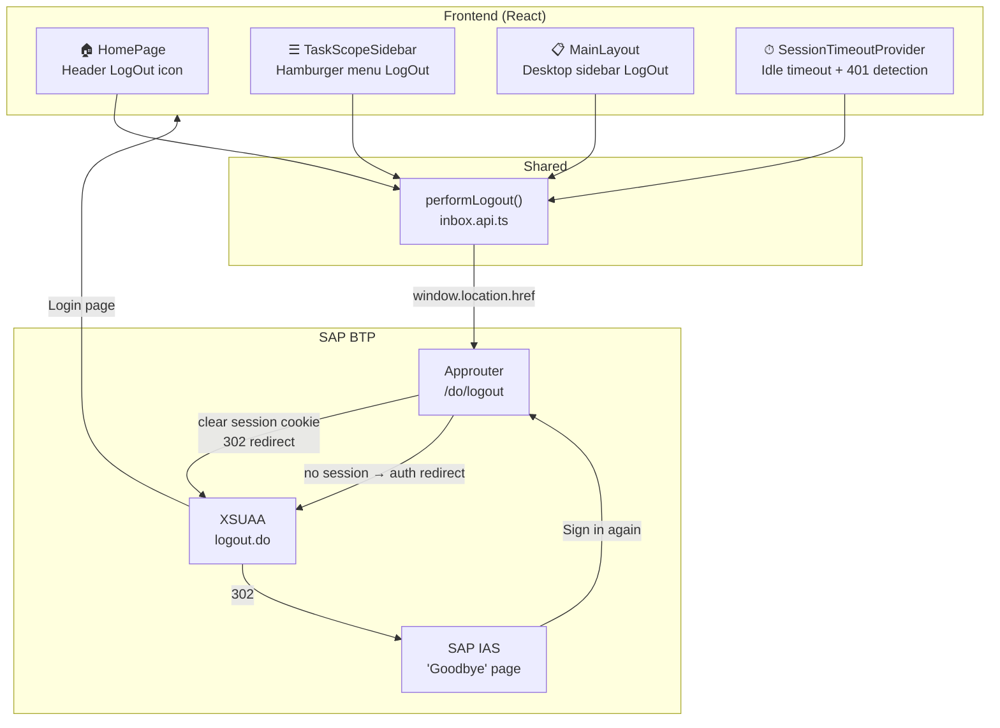
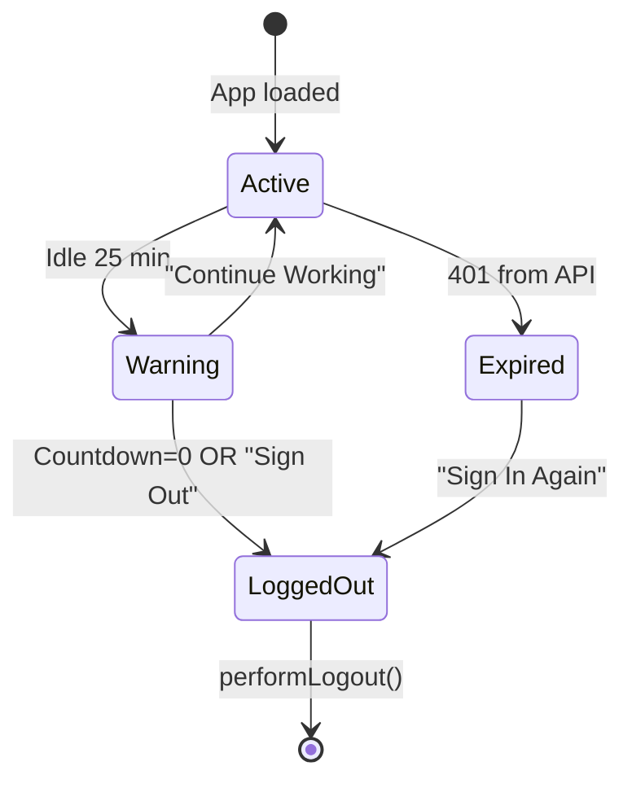
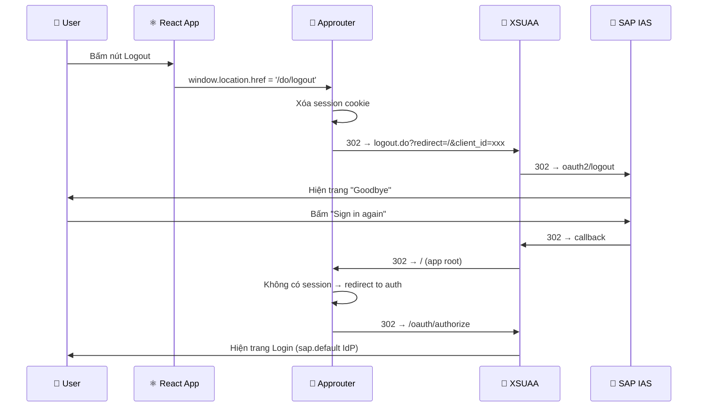

# Logout & Session Management — Feature Documentation

## 1. Tổng quan

Hệ thống quản lý phiên và đăng xuất cho ứng dụng **My Inbox**, hỗ trợ cả desktop và mobile. Bao gồm 3 thành phần chính:

1. **Manual Logout** — Nút đăng xuất trên UI (mobile header, hamburger menu, desktop sidebar)
2. **Session Timeout** — Tự động phát hiện idle + countdown trước khi auto-logout
3. **SAP Approuter Integration** — Xóa session cookie, redirect qua XSUAA/IAS để xóa token SSO

---

## 2. Kiến trúc



---

## 3. Cấu hình Approuter

### [xs-app.json](file:///D:/My%20Inbox%20-%20Vietjet/app/router/xs-app.json) (Standalone Approuter)

```json
{
  "logout": {
    "logoutEndpoint": "/do/logout",
    "logoutPage": "/"
  }
}
```

| Property | Giá trị | Mục đích |
|---|---|---|
| `logoutEndpoint` | `/do/logout` | URL mà frontend redirect đến để trigger logout |
| `logoutPage` | `/` | XSUAA redirect về `/` sau logout → approuter trigger login page |

> [!IMPORTANT]
> `logoutPage` **bắt buộc phải set**. Nếu không, approuter trả về text "Logged out" (9 bytes) thay vì redirect → iOS Safari tải file thay vì logout.

### [xs-app.json](file:///D:/My%20Inbox%20-%20Vietjet/app/cnma_vj_my_inbox_ui/public/xs-app.json) (HTML5 Repo / Managed Approuter)

Cùng config cho trường hợp app chạy qua WorkZone managed approuter.

---

## 4. Frontend — `performLogout()`

### [inbox.api.ts](file:///D:/My%20Inbox%20-%20Vietjet/app/cnma_vj_my_inbox_ui/src/services/inbox/inbox.api.ts#L290-L296)

```typescript
export function performLogout(): void {
    window.location.href = '/do/logout';
}
```

Hàm duy nhất cho toàn app, đồng bộ (sync), redirect ngay lập tức:

1. Browser redirect → `/do/logout`
2. Approuter xóa **session cookie** (quan trọng!)
3. Approuter redirect → XSUAA `logout.do?redirect=/&client_id=...`
4. XSUAA → IAS → hiện **"Goodbye"** page
5. User bấm "Sign in again" → redirect về `/` → login page

> [!WARNING]
> **KHÔNG** gọi XSUAA `logout.do` trực tiếp từ frontend. Phải đi qua approuter `/do/logout` để clear session cookie. Nếu không, session cookie vẫn valid → user vẫn "logged in" ở approuter.

---

## 5. UI — Nút Logout

### 5.1 Home Page Header (Mobile only)

**File:** [HomePage.tsx](file:///D:/My%20Inbox%20-%20Vietjet/app/cnma_vj_my_inbox_ui/src/pages/Home/HomePage.tsx#L108-L114)

Icon `LogOut` trắng ở **góc phải** header gradient, đối diện hamburger menu:

```tsx
<button onClick={() => { performLogout(); }}
    className="flex items-center justify-center w-9 h-9 rounded-lg ..."
    aria-label={t('nav.logOut', 'Log Out')}>
    <LogOut size={20} className="text-white" />
</button>
```

### 5.2 Hamburger Menu (Mobile only)

**File:** [TaskScopeSidebar.tsx](file:///D:/My%20Inbox%20-%20Vietjet/app/cnma_vj_my_inbox_ui/src/pages/Inbox/components/TaskScopeSidebar.tsx#L240-L250)

Nút "Log Out" (text đỏ + icon) ở **bottom** của drawer, phân cách bằng `border-t`:

```tsx
<div className="mt-auto border-t border-border px-5 py-4">
    <button type="button"
        onClick={() => { performLogout(); }}
        className="... text-red-600 hover:bg-red-50 ...">
        <LogOut className="w-5 h-5" />
        <span>{t('nav.logOut', 'Log Out')}</span>
    </button>
</div>
```

### 5.3 Desktop Sidebar

**File:** [MainLayout.tsx](file:///D:/My%20Inbox%20-%20Vietjet/app/cnma_vj_my_inbox_ui/src/components/layouts/MainLayout.tsx#L242-L251)

Icon `LogOut` nhỏ cạnh user profile ở bottom sidebar. Ẩn khi app chạy trong WorkZone iframe.

---

## 6. Session Timeout Provider

**File:** [SessionTimeoutProvider.tsx](file:///D:/My%20Inbox%20-%20Vietjet/app/cnma_vj_my_inbox_ui/src/components/providers/SessionTimeoutProvider.tsx)

### Config

| Hằng số | Giá trị | Mô tả |
|---|---|---|
| `IDLE_TIMEOUT_MS` | 25 phút | Thời gian idle trước khi hiện warning |
| `COUNTDOWN_SECONDS` | 60 giây | Đếm ngược trước khi auto-logout |
| `ACTIVITY_EVENTS` | mousemove, keydown, click, scroll, touchstart | Events reset idle timer |

### Flow



### 3 trạng thái dialog

| State | Trigger | Hiển thị | Actions |
|---|---|---|---|
| `hidden` | Default / "Continue Working" | Không hiện gì | — |
| `warning` | Idle 25 phút | "You are going to be signed out in **60s**" | Continue Working / Sign Out |
| `expired` | 401 từ API (via `triggerSessionExpiredGlobal()`) | "Your session has expired" | Sign In Again |

### Global Trigger

`triggerSessionExpiredGlobal()` được gọi từ `axiosInstance` interceptor khi nhận 401. Nằm ngoài React tree nên dùng global ref:

```typescript
export function triggerSessionExpiredGlobal() {
    if (globalTrigger) { globalTrigger(); }
    else { performLogout(); }
}
```

---

## 7. Logout Flow Chi Tiết



---

## 8. Identity Provider — Luôn hiển thị trang Login SAP Default

### Cách hoạt động

Mọi route có `authenticationType: "xsuaa"` trong `xs-app.json` đều kèm theo:

```json
"identityProvider": "sap.default"
```

Khi user chưa login hoặc session hết hạn, approuter redirect đến XSUAA → XSUAA redirect đến **SAP default Identity Provider** (IAS corporate login page).

### Tại sao cần `sap.default`?

| Config | Hành vi |
|---|---|
| Không có `identityProvider` | XSUAA chọn IdP tự động (có thể hiện trang chọn IdP nếu có nhiều IdP) |
| `"identityProvider": "sap.default"` | **Bỏ qua** trang chọn IdP, đi thẳng vào IdP mặc định của tenant |

> [!IMPORTANT]
> Nếu xóa `identityProvider: "sap.default"`, user có thể thấy trang "Choose Identity Provider" thay vì trực tiếp vào form đăng nhập.

### Cấu hình trong xs-app.json

**Tất cả route cần auth** đều phải có `identityProvider`:

```json
// Standalone Approuter (app/router/xs-app.json)
{
  "source": "^/api/(.*)$",
  "authenticationType": "xsuaa",
  "identityProvider": "sap.default",    // ← bắt buộc
  "destination": "srv-api"
}

// Managed Approuter (app/.../public/xs-app.json)
{
  "source": "^(.*)$",
  "target": "$1",
  "service": "html5-apps-repo-rt",
  "authenticationType": "xsuaa",
  "identityProvider": "sap.default"     // ← bắt buộc
}
```

### Ảnh hưởng đến Logout → Re-login

Khi user logout và bấm "Sign in again":

```
Goodbye → redirect / → approuter → XSUAA → sap.default IdP → Login form
```

Không có `sap.default`:
```
Goodbye → redirect / → approuter → XSUAA → ??? (có thể hiện trang chọn IdP)
```

### Routes áp dụng

| Route Pattern | File | identityProvider |
|---|---|---|
| `^/odata/v4/(.*)$` | router/xs-app.json | `sap.default` |
| `^/api/(.*)$` | router/xs-app.json | `sap.default` |
| `^/cnma/(.*)$` | router/xs-app.json | `sap.default` |
| `^(.*)$` (catch-all) | router/xs-app.json | `sap.default` |
| `^/api/inbox/(.*)$` | public/xs-app.json | `sap.default` |
| `^(.*)$` (catch-all) | public/xs-app.json | `sap.default` |

---

## 9. Danh sách file liên quan

| File | Vai trò |
|---|---|
| [app/router/xs-app.json](file:///D:/My%20Inbox%20-%20Vietjet/app/router/xs-app.json) | Cấu hình logout endpoint + logoutPage cho standalone approuter |
| [app/.../public/xs-app.json](file:///D:/My%20Inbox%20-%20Vietjet/app/cnma_vj_my_inbox_ui/public/xs-app.json) | Cấu hình logout cho managed approuter (WorkZone) |
| [inbox.api.ts](file:///D:/My%20Inbox%20-%20Vietjet/app/cnma_vj_my_inbox_ui/src/services/inbox/inbox.api.ts) | `performLogout()` — hàm logout dùng chung |
| [HomePage.tsx](file:///D:/My%20Inbox%20-%20Vietjet/app/cnma_vj_my_inbox_ui/src/pages/Home/HomePage.tsx) | Nút logout trên mobile home header |
| [TaskScopeSidebar.tsx](file:///D:/My%20Inbox%20-%20Vietjet/app/cnma_vj_my_inbox_ui/src/pages/Inbox/components/TaskScopeSidebar.tsx) | Nút logout trong hamburger menu |
| [MainLayout.tsx](file:///D:/My%20Inbox%20-%20Vietjet/app/cnma_vj_my_inbox_ui/src/components/layouts/MainLayout.tsx) | Nút logout trên desktop sidebar |
| [SessionTimeoutProvider.tsx](file:///D:/My%20Inbox%20-%20Vietjet/app/cnma_vj_my_inbox_ui/src/components/providers/SessionTimeoutProvider.tsx) | Idle timeout + session expired detection |
| [inbox-router.ts](file:///D:/My%20Inbox%20-%20Vietjet/srv/inbox/inbox-router.ts) | Backend `/logout-url` endpoint (unused, có thể xóa) |
